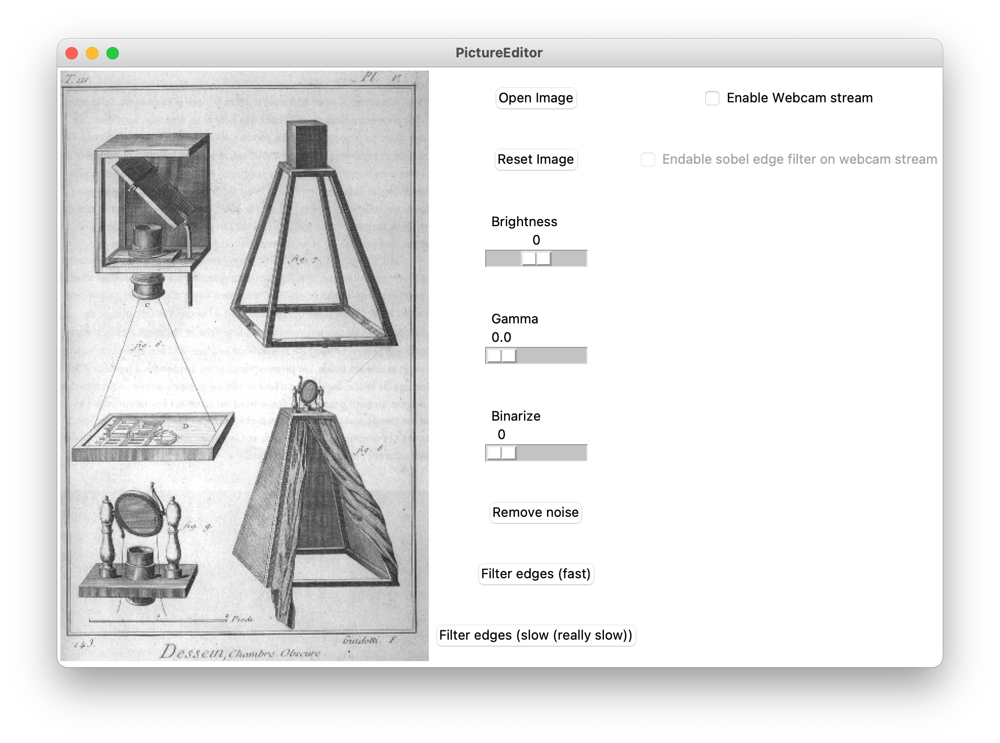

# Picture Editor

---

Author: Marcel Wagner

Date: 08.11.2020 - 31.12.2020

Hours: ~15

---

## Prerequisites
- Python 3
- tkinter
- numpy
- PIL
- OpenCV

For usage of V2 of this tool openCV is required.

## About
[Version 1](https://github.com/WagnerMarcel/Master-Autonomes-Fahren/releases/tag/Version_1.0) features a tkinter GUI for the basic image manipulation which was performed in task sheet 1 task 6.

This basic functionality was extended by a edge detection. Here to approaches have been implemented.
1. Application of the [sobel kernel](https://de.wikipedia.org/wiki/Sobel-Operator) by iterating over every pixel (Complexity is greater than rows*columns) of the array and computing its sobel values. 
2. By using the [linear separateability](https://de.wikipedia.org/wiki/Separierbarkeit) of the sobel kernel and using marix multiplication to compute the sobel values of the whole image in one step. This improved the performance of the edge detection by approx. factor 1000. 

[Version 2](https://github.com/WagnerMarcel/Master-Autonomes-Fahren/releases/tag/Version2.0) extends the functionality of Version 1 by using the openCV VideoCapture in order to make use of the webcam stream. Now the user can apply the sobel edge detection directly on the camera input stream. 

## Usage
Start the app by executing the following command (make sure that your terminal can access the webcam):

`python3 PictureEditor.py`

After the execution (and eventually granting access to the webcam) a window will open.

If you click the "Open Image" button a filedialog will select you an image of your choise. 

Your window should then look like the following.

From here the GUI should be very selfexplanatory.
